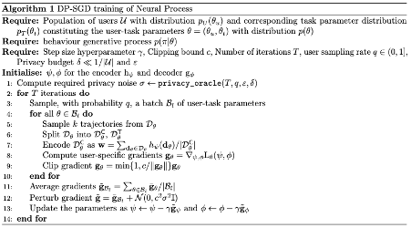
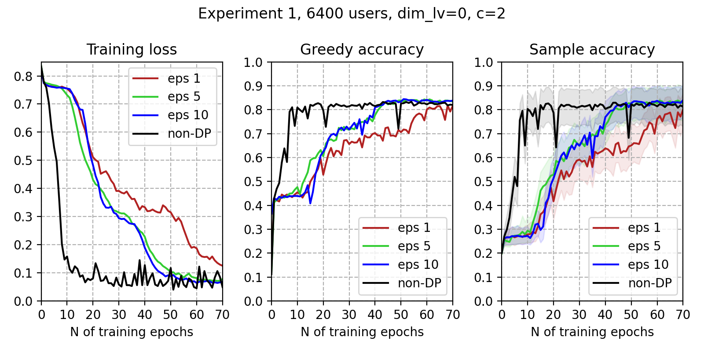
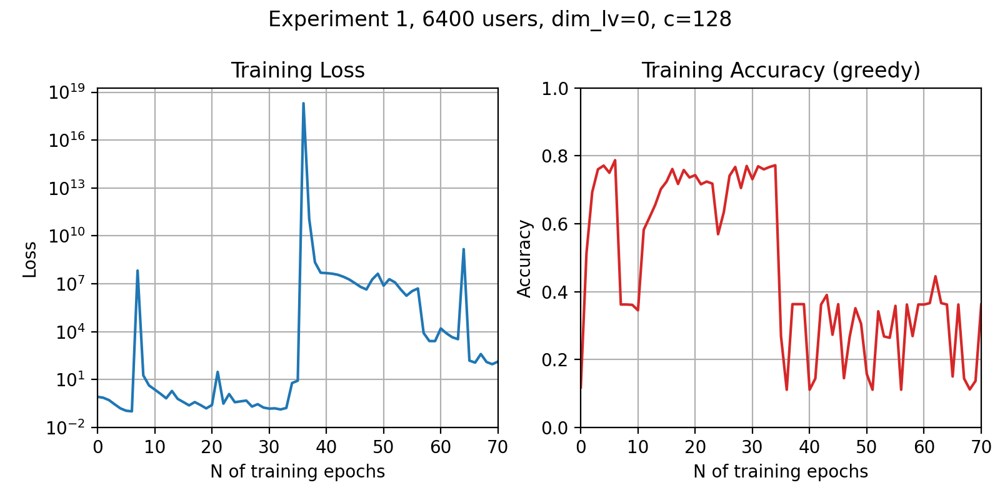

Note on L12 the width of the normal distribution is actually $\sqrt{c^{2}\sigma^2}$ 

L12 has been moved between lines 9 and 10, so the noise is added per user rather than per batch.

## Training data

Experiment 1 data are from (link here). 

## Model training

Here are the model training metrics for an AGNP (attentive gaussian neural process) model. The ELBO loss was calculated during training and the test accuracy was calculated on a separate evaluation dataset with the same distribution as the training data. 

**Accuracy**

The model outputs the probabilities of the different categories. 'Greedy accuracy' refers to the accuracy when comparing the most likely category to the true category. 'Sample accuracy' refers to considering the output probabilities as a distribution from which to sample; the sample accuracy is then the model's predicted probability of the true category.

**Latent variable dimension**

The above plots were made with the latent variable dimension (dim_lv) set to zero, meaning the model is a conditional neural process (Garnelo et al., 2018a). Testing with it set to values such as 128, 256, or 1024 resulted in unstable training performance:

